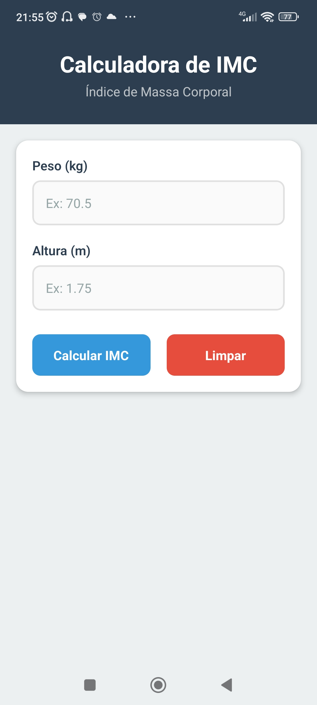
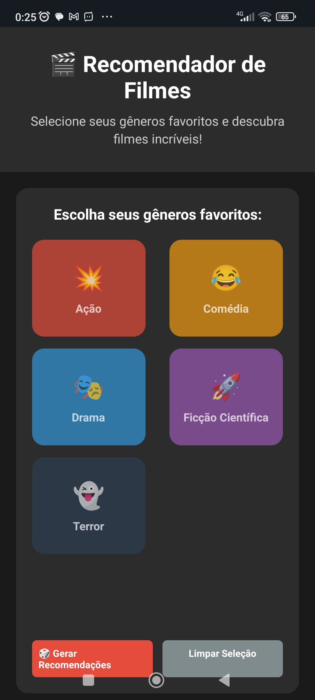
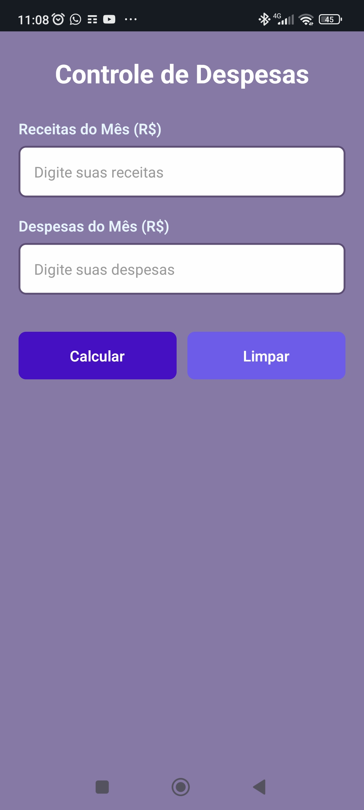
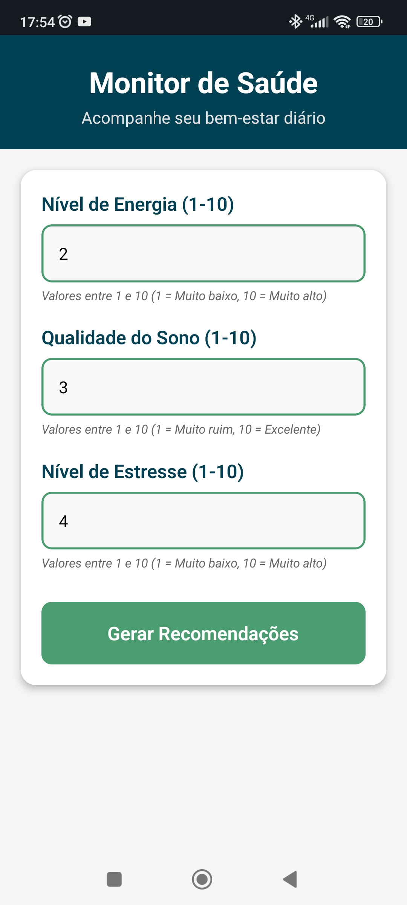
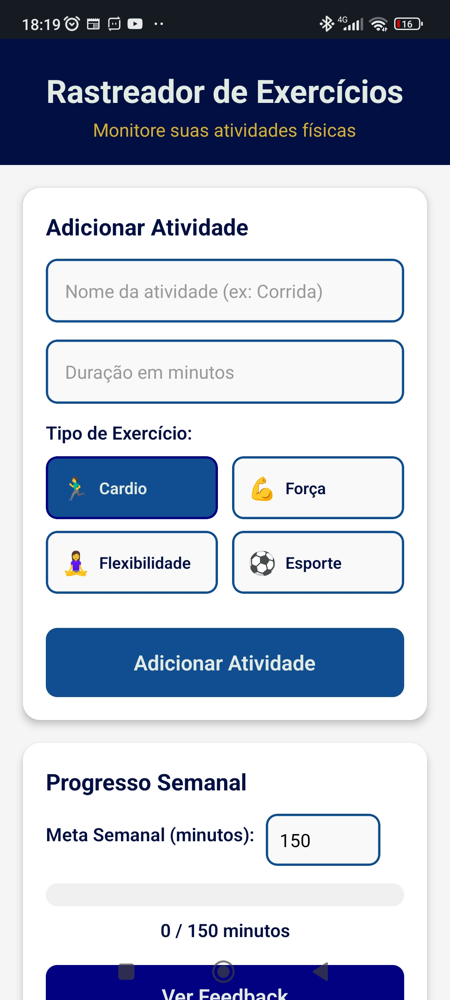
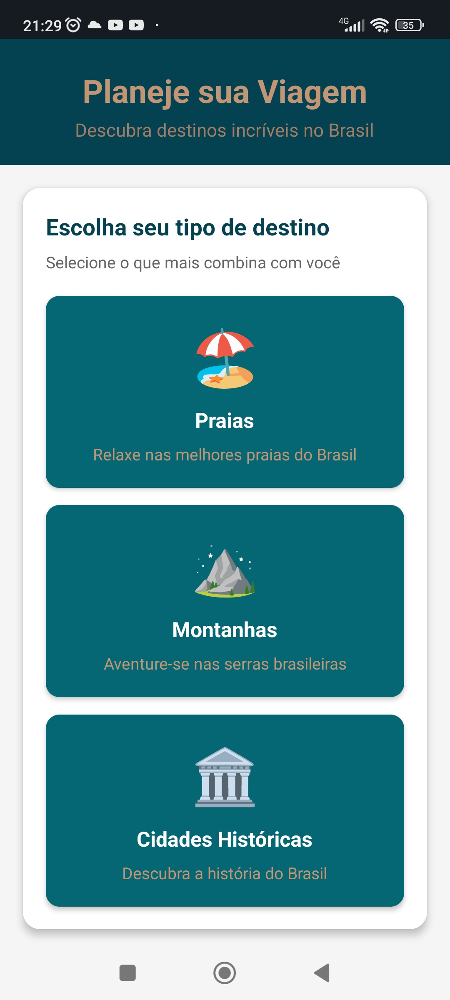
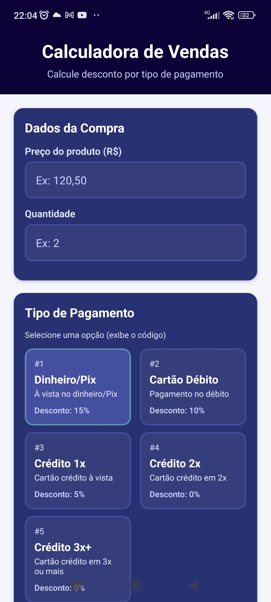

# atividades-react-native

Este repositório reúne uma coleção de aplicativos React Native desenvolvidos para a disciplina Programação para Dispositivos Móveis II.

## Apps

- [01 - Calculadora de IMC](#app-01)
- [02 - Recomendador de Filmes](#app-02)
- [03 - Controle de Despesas](#app-03)
- [04 - Jogo de Adivinhação](#app-04)
- [05 - Monitoramento de Saúde](#app-05)
- [06 - Rastreamento de Exercícios](#app-06)
- [07 - Planejamento de Viagens](#app-07)
- [08 - Valores de Venda](#app-08)

---

<h3 align="center">01 - Calculadora de IMC</h3>

<a href="01_calculadora-imc">Acessar página do app →</a>

---

<h3 align="center">02 - Recomendador de Filmes</h3>

<a href="02_gerador-filmes">Acessar página do app →</a>

---

<h3 align="center">03 - Controle de Despesas</h3>

<a href="03_controle-despesas">Acessar página do app →</a>

---

<h3 align="center">04 - Jogo de Adivinhação</h3>

<a href="04_jogo-adivinhacao">Acessar página do app →</a>

---

<h3 align="center">05 - Monitoramento de Saúde</h3>

<a href="05_monitoramento-saude">Acessar página do app →</a>

---

<h3 align="center">06 - Rastreamento de Exercícios</h3>

<a href="06_rastreamento-exercicios">Acessar página do app →</a>

---

<h3 align="center">07 - Planejamento de Viagens</h3>

<a href="07_planejamento-viagens">Acessar página do app →</a>

---

<h3 align="center">08 - Valores de Venda</h3>

<a href="08_valores-venda">Acessar página do app →</a>

